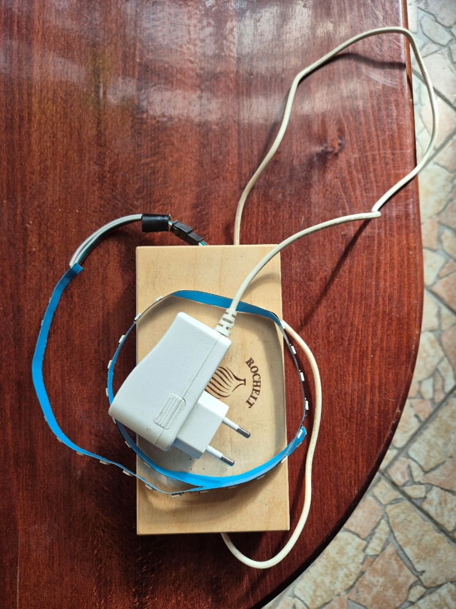
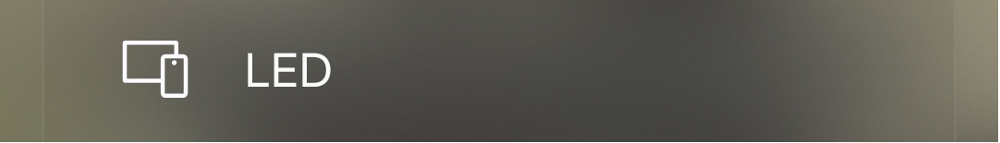
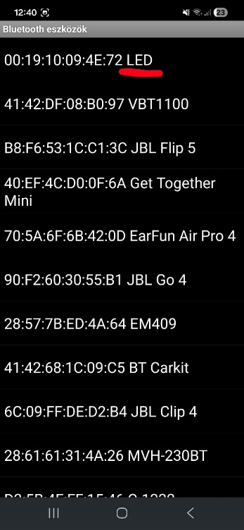
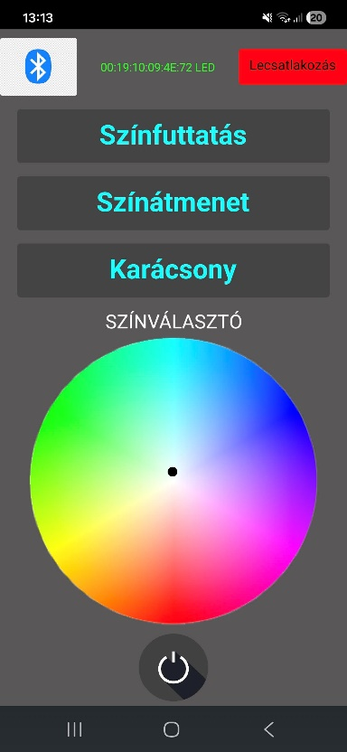
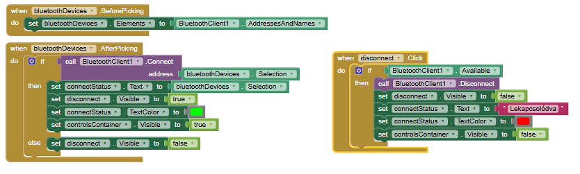
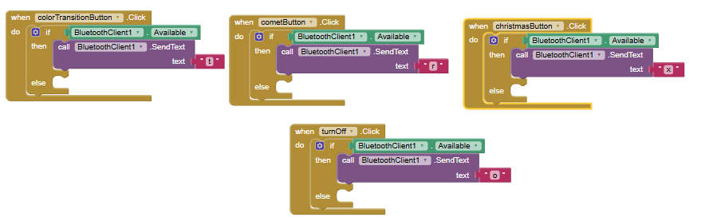
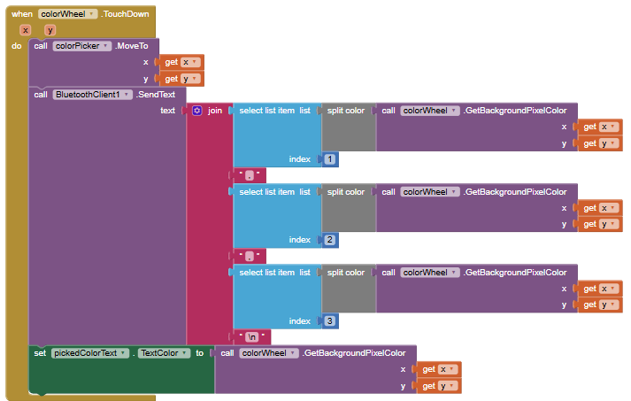
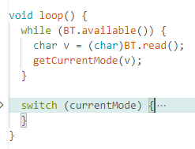
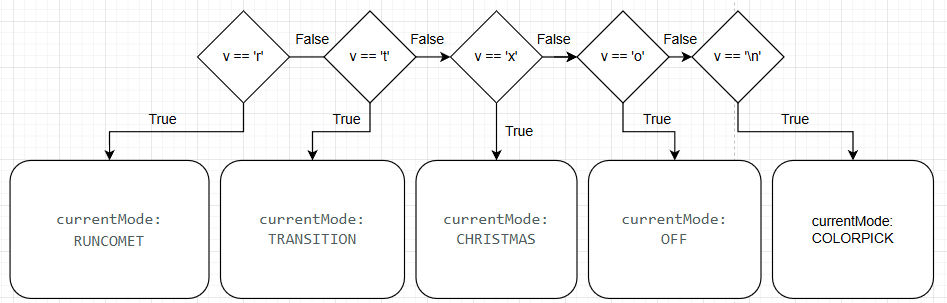

# Felhasználói dokumentáció

## Szükséges komponensek 

- Telefon, amire telepítve van a vezérlő alkalmazás

  - Tesztelés esetén lehet használni a Serial Bluetooth Terminal appot
    is

- Maga az Arduino projekt

## Telefonos alkalmazás használata

1.  Első lépésként adjunk áramot a projektnek.

2.  Ezután kapcsoljuk be a Bluetooth-t a telefonon és párosítsuk össze a
    LED elnevezésű Bluetooth eszközzel

>  style="width:6.29167in;height:0.89583in" />
>
> A párosítás során szükséges jelszót megadni, ez alapértelmezetten 1234
> vagy 0000

3.  Sikeres párosítást követően indíthatjuk az alkalmazást. Indítást
    követően ez a felület fogad minket:

4.  Bal felső sarokban nyomjuk meg a Bluetooth ikonnal elátott gombot,
    ekkor megjelennek a párosított eszközeink listája:

Válasszuk ki a LED eszközt.

5.  Sikeres csatlakozás esetén az alkalmazás visszadob a fő felületre,
    ahol már lehetőségünk van irányítani a led szalagot:

A felületen található funkciók:

- Lecsatlakozás gombra kattintva le tudunk csatlakozni az aktuálisan
  csatlakoztatott Bluetooth eszközről

- Színfuttatás funkció

  - A led az elejétől a végéig 10-es csoportokban felkapcsolódnak.
    Egyszerre mindig csak 10 led ég, miközben a led színe folyamatosan
    változik. Videó: Szinfuttatas.mp4

- Színátmenet

  - Az összes led ég, miközben a színek váltakoznak. Videó:
    Szinatmenet.mp4

- Karácsony

  - Páros és páratlan indexű ledek váltakozása, először minden páros
    indexű led ég, majd elhalványulva elalszik miközben minden páratlan
    kezd el égni és ezt így felváltva. Videó: Karacsony.mp4

- Színválasztó

  - A színválasztó képre kattintva vagy a színválasztó közepén található
    kis fekete gombbal van lehetőségünk egy bizonyos szín beállítására.

- Kikapcsoló gomb

  - A gomb megnyomásával “feketére” állítjuk a ledek színét, azaz
    kikapcsoljuk.

# 

# Fejlesztői dokumentáció

## Telefonos alkalmazás kódja

Bluetooth kezelés

A BluetoothDevices nevű komponens egy lista, amit rögtön feltöltök a
párosított eszközök MAC-címével és nevével.

Ezzel együtt megjelenik a Lekapcsolódás gomb is.

Miután a listából kiválasztunk egy eszközt és sikeresen csatlakozunk rá,
a led funkciók (gombok, színválasztás) felületet láthatóvá teszem és
megjelenítem az éppen aktuális eszköz MAC-címét és nevét.

Gombok

Mindegyik gombnyomás elküld egy karaktert a Bluetooth eszköznek.

- cometButton (Színátmenet) elküldi az ‘r’ karaktert.

- colorTransition (Színátmenet) elküldi a ‘t’ karaktert.

- christmasButton (Karácsony) elküldi az ‘x’ karaktert.

- turnOff (Kikapcsoló gomb) elküldi az ‘o’ karaktert.

Színválasztás

Akkor fut le ez a kód, amikor a színválasztóra rábökünk.

Ekkor a színválasztó található gombot is áthelyezi arra a területre,
ahova böktünk.

Amikor rányomunk a színválasztóra, akkor a megadott pixel színét
(rgb-ben) visszakapjuk x és y koordináta alapján, amit összefűzök
vesszőkkel és a végén egy \n karakterrel. pl.: Rányomunk egy színre,
akkor ezt küldjük el a Bluetooth-on keresztül: vörös szín értéke, zöld
szín értéke, piros szín értéke\n

Amikor a kis gombot mozgatjuk a színválasztón, akkor a Dragged funkció
beállítja a gomb új helyzetét.

A TouchUp funkció ugyanúgy elküldi a Bluetooth eszköznek a beállított
rgb színt.

## Hardware

### Szükséges elektronikai eszközök

- Tápegység

  - 5V, áramerrőség: 2.5 A.

- Arduino UNO

  - Ebben a projektben az UNO R3-as verzióját használom

- HC-05 bluetooth modul

- WS2812b led (40db)

- 330Ω, 2.2kΩ és 4.7kΩ ellenállások

- Jumper vezetékek

### Elektronikai eszközök összekapcsolása

Az egyszerűség kedvéért thinkercad-ben összeraktam egy kis projektet,
amin keresztül bemutatom a kapcsolást.

A thinkercad nem tartalmaz Bluetooth modult, ezért ezt egy sima led
helyettesíti.

Tápegység

- A 40 db led közvetlenül a tápegységbe van bekötve és nem a
  szerelőlapon keresztül.

Ez biztosítja, hogy nagyobb áram felvétele esetén ne történjen
feszültségingadozás.

- 1db led áramfelvétele max 60mA, jelen esetben ebből 40db van, így ez
  2400mA.

- A szerelőlap sínei általában nem bírnak ekkora áramot, hosszabb távon
  a sínek felmelegedhetnek, a burkolat megolvadhat.

- Az Arduino UNO és Bluetooth modulnak sokkal kevesebb szükséges, így
  amikor hirtelen nagy áramot kap a sín a ledek miatt az Arduino
  resetelhet vagy a Bluetooth lekapcsolódhat (ez meg is történt velem,
  amikor a ledeket is a sínen keresztül kötöttem be).

Ezért ajánlott a ledeket közvetlenül a tápegységbe bekötni, az Arduinot
és a többi modult elkülönítve a szerelőlapon!

LED

- A ledek közvetlenül vannak összekötve a tápegységgel.

- A lednek a DIN pinje az Arduino 8-as pinjébe csatlakozik egy 330Ω-os
  ellenálláson keresztül. Az ellenállás nem kötelező, de erősen ajánlott
  jelstabilizálásra és jelvédelemre.

Arduino UNO

- Az Arduino UNO ugyanettől a tápegységtől kapja az áramot csak a
  szerelőlapon keresztül.

A tápegység pozitív vezetéke az Arduino 5V pinjébe csatlakozik, a
negatív vezeték pedig a GND pinbe.

Bluetooth modul

- A Bluetooth modul VCC vezetéke a tápegység pozitív vezetéke
  csatlakozik. A modul 3.3V – 6V feszültségre van tervezve, így az 5V
  megfelelő.

- A tápegység negatív vezetéke a Bluetooth modul GND pinjébe
  csatlakozik.

- A Bluetooth TX (Transmit) pinje az Arduino 2-es pinjébe csatlakozik.

  - A kódban az Arduino 2-es pinje RX-ként van értelmezve (Bluetooth ide
    küld, Arduino itt fogad adatot)

- A Bluetooth RX (Receive) pinje az Arduino 3-as pinjébe csatlakozik egy
  feszültségosztón keresztűl.

  - A Bluetooth RX pinje 3.3V logikai szintet vár, viszont az Arduino
    pinjei 5V-on küldenek jelet. Feszültségosztás nélkül hosszabb távon
    akár károsodhat is a Bluetooth modul!

> A feszültségosztóhoz egy 2.2kΩ és 4.7kΩ ellenállásokat használok.
>
> Arduino 3-as pinből a vezeték csatlakozik a 2.2kΩ ellenállás egyik
> lábával.
>
> A 2.2kΩ sorosan kapcsolódik a 4.7kΩ-os ellenállással, aminek az egyik
> lába össze van kötve a GND-vel.
>
> A két ellenállás közti ponton így létrejön a kb 3.3V-os feszültség,
> így a két ellenállás között helyeztem el a vezetéket, ami csatlakozik
> az Bluetooth RX pinjéhez.

- A kódban az Arduino 3-as pinje TX-ként van értelmezve.

## Szoftver

### Setup

A ledek irányításához FastLED könyvtárt használok, a setup-ban beállítom
a FastLED-et a ledek adataival, illetve elindítom a Bluetooth-t.

### Loop

Amikor küldünk egy adatot a Bluetooth-nak, akkor lefut a getCurrentMode
metódus, ami feldolgozza a beolvasott adatot és beállítja az aktuális
funkciót.

Az aktuális funkciók lehetséges értékei: OFF, RUNCOMET, CHRISTMAS,
COLORPICK,

NONE

getCurrentMode folyamatábra:

A beolvasás után a currentMode értéke alapján lefuttatjuk a kiválasztott
funkció függvényét.

- RUNCOMET esetében lefut a comet() függvény

- TRANSITION esetében lefut a colorTransition() függvény

- CHRISTMAS esetében lefut a christmas() függvény

- COLORPICK esetében lefut a setColorFromString(const String& msg)
  függvény

- OFF esetén a ledet kikapcsoljuk

## LED funkciói

### Színfuttatás – RUNCOMET – comet()

Változók:

lastFrame és transitionComet = A két változót arra használom, hogy
meghatározzuk mikor kell a következő animációt elindítani.

A transitionComet-el lehet állítani, az animáció sebességét.

groupSize = Mennyi led égjen egyszerre

idx = Melyik ledet kell éppen felkapcsolni

- Figyelni kell arra, hogy az idx ne okozzon indexelési problémákat.

  - Az idx nem lehet negatív: while(idx \< 0) idx += NumLeds;

  - Az idx nem indexelhet túl a led tömbön: LED\[idx % NumLeds\]

hue = Meghatározza a led színét, ami minden egyes animáció után
változik.

stepIdx = Ez a változó lépteti tovább folyamatosan a ledeket.

### Színátmenet – TRANSITION – colorTransition()

Változók:

lastFrame és transitionColor = Animáció sebességének meghatározása. A
transitionColor-al tudjuk állítani az animáció sebességét.

FastLED könyvtár fill_solid() funkciója beállítja egy adott színre az
összes ledet.

hue = Meghatározza a led színét, ami minden egyes animáció után
változik.

### Karácsony – CHRISTMAS – christmas()

Változók:

lastXmas és xmasInterval = Animáció sebességének meghatározása. Az
xmasInterval-al tudjuk állítani az animáció sebességét.

switchLeds=

xmasPhase

xmasStep

holdOnFrames

holdOffFrames

holdCnt

XmasHoldState

### Színválasztó – COLORPICK – setColorFromString()

Bluetoothon keresztül kapunk egy rgb színösszeállítást, amit be tudunk
állítani az összes lednek.

Példa adat: 210,134,110

Ezt feldolgozzok úgy, hogy az első szín az r, a második a g, a harmadik
pedig a b.

fill_solid-al beállítjuk az rgb színt a lednek.
